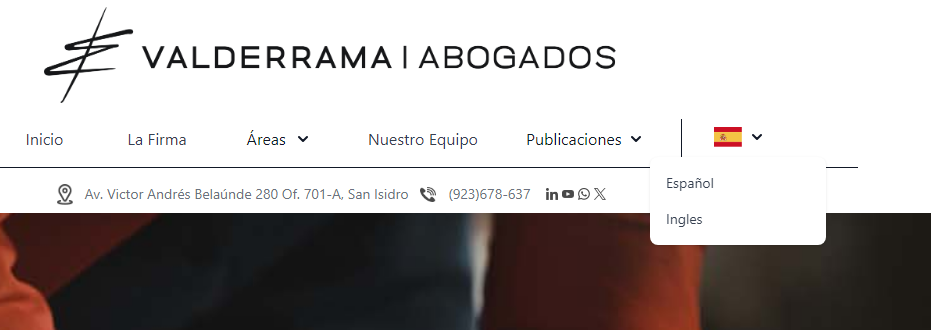

<!-- 0.- TRANSLATE-V1-->

# LIBRERIA DE MULTILENGUAJE TRANSLATE

## GITHUB: MUR_FROM

### Nota 1: todos los enlaces deben tener routerLink para que no refresque la pagina ya que si refresca volvera al idioma por defecto.

<!-- /0.- TRANSLATE-V1-->
