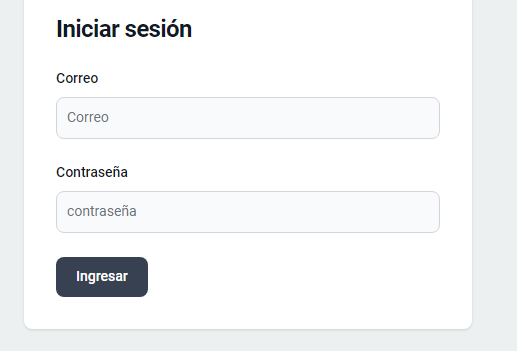

<!-- 0.- LOGIN_REGISTER_BASICO-V1-->

# LOGIN BASICO ANGULAR 17 CON LARAVEL 10 Y JWT

## GITHUB: MUR_BACKEND (PARTE 1), MUR_ADMIN (PARTE 2)

<!-- /0.- LOGIN_REGISTER_BASICO-V1-->

<!-- 12.- LOGIN_REGISTER_BASICO-V1-->

# ENLACE - IMAGENES DE EJEMPLO DE POSTMAN

[enlace imagenes de ejemplo postman](https://docs.google.com/document/d/1-ZNhPkO5miKjyZrJ3XotMa3AxL6k4YL4IN3pEFhDKx8/edit "Título opcional")

<!-- /12.- LOGIN_REGISTER_BASICO-V1-->
