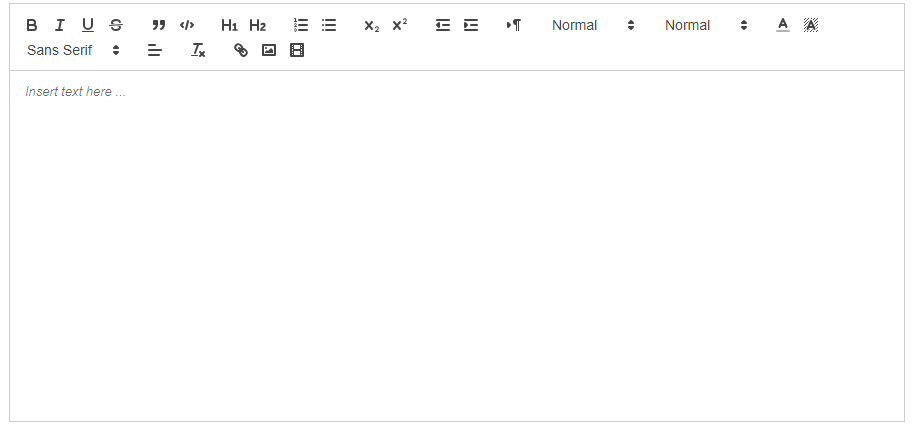

# Encabezado 1

## Encabezado 2

### Encabezado 3

- Item 1
- Item 2
  - Subitem 2.1
  - Subitem 2.2

1. Primer item
2. Segundo item
3. Tercer item

> Esto es una cita.
> Puede abarcar múltiples líneas.

---

---

---

| Encabezado 1 | Encabezado 2 |
| ------------ | ------------ |
| Celda 1      | Celda 2      |
| Celda 3      | Celda 4      |

[Texto del enlace](https://google.com "Título opcional")

